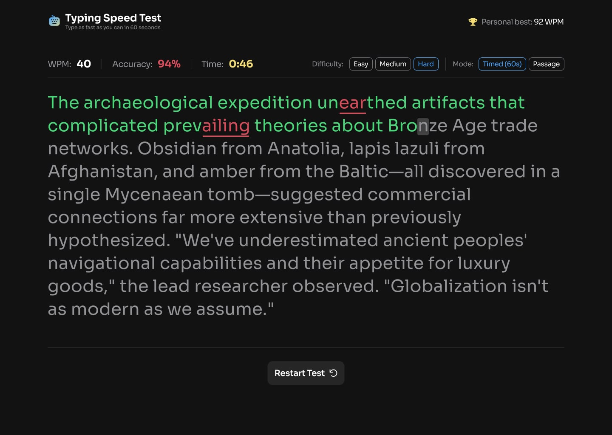

# Typing Speed Test

A responsive typing speed test application built as a solution to the Frontend Mentor Typing Speed Test challenge.

Users can test their typing speed, accuracy, and consistency through timed or passage-based typing challenges while tracking their personal high score.

---

## Table of Contents

- [Overview](#overview)
  - [The Challenge](#the-challenge)
  - [Screenshot](#screenshot)
  - [Links](#links)
- [My Process](#my-process)
  - [Built with](#built-with)
  - [Technical Highlights](#technical-highlights)
  - [What I Learned](#what-i-learned)
  - [Continued Development](#continued-development)
  - [Useful Resources](#useful-resources)
  - [AI Collaboration](#ai-collaboration)
- [Author](#author)

---

# Overview

## The Challenge

The goal of this project was to build a realistic typing speed application that allows users to:

- View a responsive layout across desktop and mobile devices
- Select typing difficulty levels
- Choose between timed and passage modes
- Type against dynamically generated passages
- Track WPM and typing accuracy
- Receive performance results after completing a test
- Save and improve their personal high score

## Screenshot

## Links

- Solution URL: [GitHub Repository](https://github.com/dlewisSTL/Typing-Speed-Test)
- Live Site URL: [Live Demo](https://typing-speed-test-umber-two.vercel.app)

---

# My Process

## Built with

- Semantic HTML5 markup
- CSS custom properties
- CSS Flexbox
- Mobile-first responsive design
- Vanilla JavaScript
- DOM manipulation
- Local Storage API
- Fetch API
- JSON data handling

## Technical Highlights

- Built a complete typing engine using vanilla JavaScript
- Created dynamic character-level validation while typing
- Implemented real-time WPM and accuracy calculations
- Added persistent user settings using Local Storage
- Loaded typing passages dynamically using Fetch API and JSON data
- Designed responsive desktop and mobile experiences
- Built the application using a modular JavaScript structure with separated sections for state, events, test logic, scoring, and UI updates

---

## What I Learned

This project helped strengthen my understanding of building interactive frontend applications without relying on a framework.

Some of the main concepts I practiced:

### Application State Management

I created and managed application state for:

- Current typing passage
- Selected difficulty
- Test mode
- Timer status
- User progress
- High score tracking

### DOM Manipulation

I dynamically generated typing passages by converting text into individual character elements and updating their state as the user typed.

Examples:

- Correct characters
- Incorrect characters
- Current typing position

### Timer and Performance Calculations

I implemented:

- Countdown timers
- Elapsed time tracking
- Words-per-minute calculations
- Accuracy calculations
- Performance result screens

### Persistent Data

I used Local Storage to save:

- User preferences
- Personal high scores
- Completed test status

This allowed the application to maintain user progress between sessions.

---

## Continued development

Future improvements I would like to explore:

- Add additional typing statistics such as:
  - Characters per minute (CPM)
  - Error frequency
  - Typing consistency

- Add user accounts and cloud-based score tracking

- Rebuild the application using React and TypeScript to compare approaches between vanilla JavaScript and modern frontend frameworks

- Add animations and additional accessibility improvements

---

## Useful resources

- [Frontend Mentor](https://www.frontendmentor.io/) - Provided the design challenge and project requirements.

- [MDN Web Docs](https://developer.mozilla.org/) - Used as a reference for JavaScript, DOM APIs, Fetch, and browser functionality.

- [JavaScript.info](https://javascript.info/) - Helpful reference for JavaScript concepts and patterns.

---

## AI Collaboration

I used ChatGPT as an AI development assistant throughout this project.

AI was used for:

- Debugging JavaScript issues
- Reviewing application architecture
- Discussing code organization
- Exploring improvements and refactoring opportunities
- Troubleshooting UI behavior

The development process remained hands-on, with AI acting as a collaboration and problem-solving tool rather than replacing implementation.

---

# Author

- Website - [Derek Lewis](https://derek-lewis.com/)
- Frontend Mentor - [@dlewisSTL](https://www.frontendmentor.io/profile/dlewisSTL)

